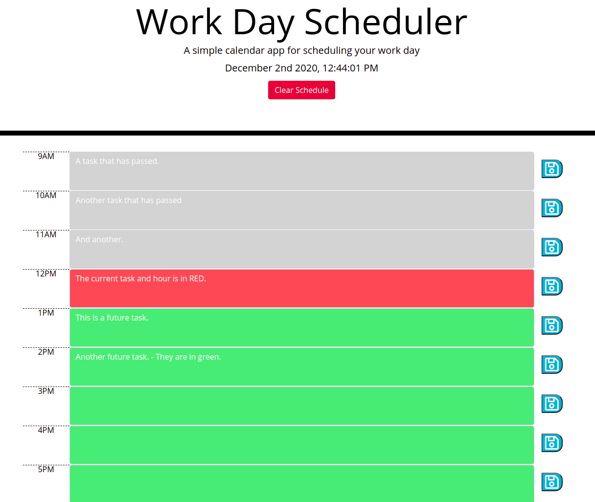

# Work Day Scheduler

This is a dead simple work day scheduler that uses standard business hours to help plan out your work day in 1 hour blocks. Time slots are color coded indicating past, present and future events in your daily schedule.

- [x] Display date at the top of page within header.
- [x] Standard business hours of 9 to 5 displayed.
- [x] Timeblocks are dispayed and color coded. (Red for current hour, Gray for past events and Green for future events.)
- [x] When the save button is pressed the events for that hour are saved in localstorage.
- [x] Use a 3rd party library like Moment.js and jQuery to complete the project assignment.
**Bonus**
- [x] Clear the day and saved data with one button to start fresh if needed.

### Screenshot(s)

### License

This project and all of its source code is released and permissively licensed under the [BSD 2 Clause](LICENSE.md) license.